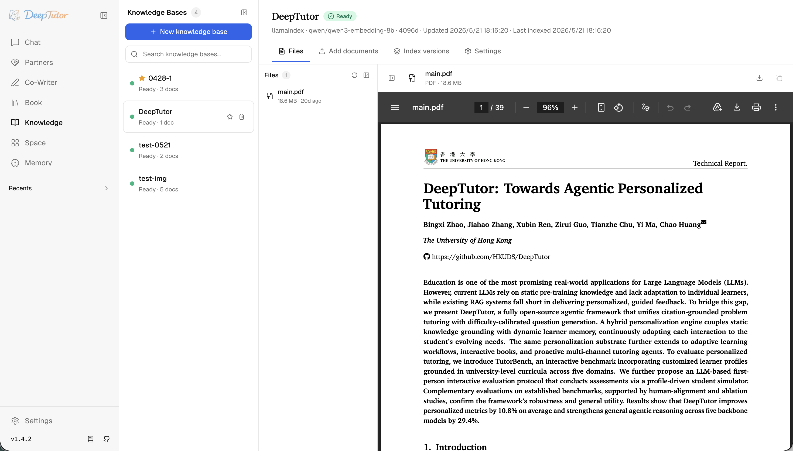
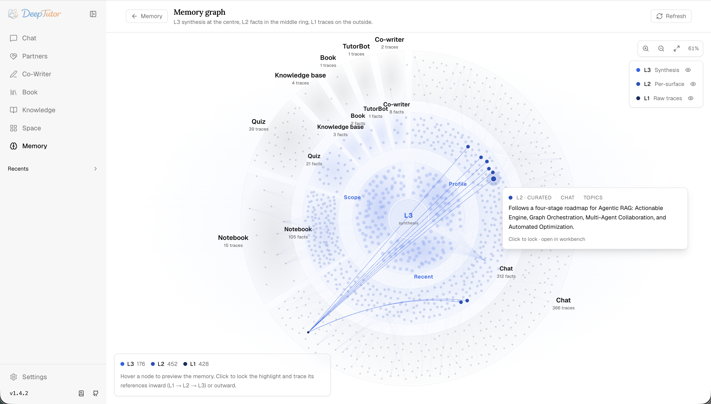

<div align="center">

<br/>

<a href="#readme">
  
  &nbsp;&nbsp;&nbsp;&nbsp;
  
</a>

<h3>Local-First AI Tutoring, Computer Vision Study Supervision & Exam Room</h3>

<p align="center">
  <b>Private by Design</b> • <b>100% On-Device CV</b> • <b>Passcode-Gated Parent Portal</b> • <b>Verbatim Exam Room</b>
</p>

<p align="center">
  <a href="#-quick-start"></a>
  <a href="docs/AI-GURU-RUN-GUIDE.md"></a>
  <a href="docs/AI-GURU-PARENT-ACCESS.md"></a>
  <a href="docs/AI-GURU-CODEBASE-MAP.md"></a>
</p>

---

<p align="center">
  
  
  
  
  
  
  
  
</p>

<p align="center">
  <a href="#-overview">Overview</a> •
  <a href="#-key-features">Key Features</a> •
  <a href="#-system-architecture">Architecture</a> •
  <a href="#-quick-start">Quick Start</a> •
  <a href="#-web-interface--visuals">Screenshots</a> •
  <a href="#-configuration">Configuration</a> •
  <a href="#-repository-structure">Project Layout</a> •
  <a href="#-documentation-hub">Docs</a> •
  <a href="#-test-suite">Testing</a> •
  <a href="#-privacy--zero-trust-security">Privacy & Security</a>
</p>

</div>

---

## 🌟 Overview

**AI Guru** transforms any consumer laptop or desktop into an autonomous, privacy-first tutoring workstation and intelligent study supervisor. Built on top of the battle-tested [DeepTutor](https://github.com/HKUDS/DeepTutor) v1.5.11 agent-core, AI Guru augments state-of-the-art interactive LLM pedagogy with **local real-time computer vision study monitoring**, a **past-paper Exam Room with verbatim extraction & AI judging**, and a **PIN-gated Parent Portal** featuring encrypted incident vaults and secure Telegram alerts.

### 🛡️ Why AI Guru?

1. **Zero Biometrics in the Cloud:** Face detection, gaze estimation, head pose tracking, and study posture analysis run **100% in the client browser** via MediaPipe WASM. No video feeds or face landmarks ever leave your hardware.
2. **Local-First Persistence:** All session telemetry, notebooks, past papers, and gamification metrics are committed to local SQLite databases with write-ahead logging (WAL).
3. **Zero-Config Remote Supervision:** Parents can monitor focus metrics, receive alert notifications on Telegram, or securely connect via Cloudflare/ngrok tunnels with strict PBKDF2-derived token auth.
4. **Resilient AI Execution:** Integrates cloud models (OpenAI, Anthropic, Gemini, DeepSeek, Groq) or local LLMs (Ollama) with intelligent fallback chains for fully offline study sessions.

> ℹ️ **Dual-Branding Architecture:** User-facing interfaces and notifications display **AI Guru**. Internal modules, CLI commands, environment variables (`DEEPTUTOR_*`), and package namespaces retain `deeptutor` for full drop-in compatibility with the upstream ecosystem.

---

## 🚀 Key Features

<table>
  <tr>
    <td width="50%" valign="top">
      <h3>👁️ On-Device Study Monitoring</h3>
      <ul>
        <li><b>MediaPipe WASM Engine:</b> Real-time 468-point face mesh tracking directly in browser.</li>
        <li><b>Intelligent Distraction Filter:</b> Whitelists natural study actions (reading notebook, writing, drinking water).</li>
        <li><b>Warning Rate-Limiter:</b> Confidence threshold (&ge; 0.8), 60s cooldown, max 5 warnings per 10 min window.</li>
        <li><b>Pomodoro Study Room:</b> Pre-flight lighting/camera calibration, live focus dials, and AI session summaries.</li>
      </ul>
    </td>
    <td width="50%" valign="top">
      <h3>📝 Verbatim Exam Room</h3>
      <ul>
        <li><b>Past-Paper Ingestion:</b> Extracts full exams preserving question numbering, diagrams, and options.</li>
        <li><b>Server-Side MCQ Evaluation:</b> Instant deterministic auto-grading matching QuizViewer semantics.</li>
        <li><b>AI Essay Judge:</b> Multi-criteria evaluation against hidden reference keys revealed only after submission.</li>
        <li><b>XP & Rewards:</b> Automatic mastery updates, streak tracking, and XP awards.</li>
      </ul>
    </td>
  </tr>
  <tr>
    <td width="50%" valign="top">
      <h3>👨‍👩‍👧 Passcode-Gated Parent Portal</h3>
      <ul>
        <li><b>PBKDF2 PIN Gate:</b> Rate-limited lockout protection with 15-minute access JWTs and 7-day refresh.</li>
        <li><b>Encrypted Incident Vault:</b> <code>GURUVAULT02</code> envelope (random key wrapped with PBKDF2-600k HMAC verification).</li>
        <li><b>Zero-Config Tunnels:</b> Built-in Cloudflared / ngrok watchdog for secure remote access without port forwarding.</li>
        <li><b>Telegram Bot Dispatch:</b> Outbound queue with exponential retry backoff (30s &times; 2<sup>n</sup>, cap 600s, max 8 tries).</li>
      </ul>
    </td>
    <td width="50%" valign="top">
      <h3>🎓 Complete Tutor Core (DeepTutor)</h3>
      <ul>
        <li><b>Multi-Agent Chat Loop:</b> Grounded tool execution, web research, file attachments, and subagent delegation.</li>
        <li><b>Living Book & Co-Writer:</b> Interactive interactive block compiler & selection-aware markdown drafting with visual diffs.</li>
        <li><b>Multi-Engine RAG:</b> Hybrid knowledge indexing (LlamaIndex, PageIndex, GraphRAG, LightRAG, Obsidian).</li>
        <li><b>Floating Assistant:</b> Draggable PiP bubble with text-selection chips, <code>Alt+Space</code> quick launch, and cross-tab sync.</li>
      </ul>
    </td>
  </tr>
</table>

---

## 🏛️ System Architecture

```
+─────────────────────────────────────────────────────────────────────────────+
│                           CLIENT BROWSER (UI & CV)                          │
│                                                                             │
│   Next.js 16 (React 19) App Router        MediaPipe FaceLandmarker (WASM)   │
│   ├── Student Workspace (Study/Exam/Book)  ├── 468-Point Realtime Mesh       │
│   ├── Floating Guru (Draggable / PiP)      ├── Head Pose & Gaze Estimation   │
│   └── Parent Portal Dashboard              └── Study Action Whitelist Filter │
+──────────────────────────────────────┬──────────────────────────────────────+
                                       │ HTTP / Secure WebSocket (JWT/Cookie)
                                       v
+─────────────────────────────────────────────────────────────────────────────+
│                    AI GURU LOCAL BACKEND ENGINE (FastAPI :8001)             │
│                                                                             │
│   Tutor Core (Upstream DeepTutor)           AI Guru Supercharged Services   │
│   ├── AgentLoop & Reasoning Orchestrator   ├── services/monitoring/ (CV FSM)│
│   ├── capabilities/ (Quiz, Solve, Math)    ├── services/exams/ (AI Grading) │
│   ├── services/llm/ (Cloud / Ollama)       ├── services/gamification/ (XP)  │
│   └── services/rag/ (GraphRAG / LightRAG)  └── services/remote/             │
│                                                ├── Tunnel Gateway           │
│                                                ├── Telegram Notification Q  │
│                                                └── GURUVAULT02 Encrypted DB │
+──────────────────────────────────────┬──────────────────────────────────────+
                                       │ aiosqlite (WAL Mode)
                                       v
+─────────────────────────────────────────────────────────────────────────────+
│                       LOCAL DATABASE (chat_history.db)                      │
│                                                                             │
│   11 Core Tables + Exam Registry • PRAGMA Foreign Keys • Schema Migrations  │
+─────────────────────────────────────────────────────────────────────────────+
```

---

## ⚡ Quick Start

### 📋 Prerequisites

| Requirement | Supported Versions | Notes |
|:---|:---|:---|
| **Python** | `3.11`, `3.12`, `3.13` | Tested on 3.12 (standard venv) |
| **Node.js** | `20.x` or `22.x LTS` | Required for Next.js web application |
| **Operating System** | Windows 10/11, macOS, Linux | PowerShell 5.1+ / bash / zsh |

---

### 💻 Installation & Startup

#### 1. Clone & Set Up Python Environment

```bash
# Clone the repository
git clone https://github.com/Javitha080/AI-Guru.git
cd AI-Guru

# Create & activate Python virtual environment
# Windows (PowerShell):
python -m venv .venv
.\.venv\Scripts\Activate.ps1

# Linux / macOS:
# python3 -m venv .venv
# source .venv/bin/activate

# Upgrade pip and install package in editable mode
python -m pip install --upgrade pip
python -m pip install -e .
```

#### 2. Install Frontend Dependencies

```bash
cd web
npm ci --legacy-peer-deps
cd ..
```

#### 3. Launch AI Guru

```bash
# Start backend (8001) and frontend (3782) together:
deeptutor start

# Or in development mode with Next.js HMR:
deeptutor start --dev
```

> 💡 **Windows Direct Launch:** You can also run `.venv\Scripts\python.exe -m deeptutor_cli.main start` directly from PowerShell.

---

### 🌐 Access Endpoints

| Service | Address | Description |
|:---|:---|:---|
| **Student & Parent Web UI** | `http://localhost:3782` | Main unified Next.js web application |
| **Backend REST API** | `http://127.0.0.1:8001` | FastAPI local server |
| **Interactive API Docs** | `http://127.0.0.1:8001/docs` | Swagger UI documentation |
| **System Health Check** | `http://127.0.0.1:8001/api/v1/health` | Service status JSON payload |

---

### 🐳 Docker Container Deployment

AI Guru is fully containerized. Run the official image with a single port exposed (the frontend internally proxies API and WebSocket requests):

```bash
docker run -d \
  --name ai-guru \
  -p 127.0.0.1:3782:3782 \
  -v aiguru_data:/app/data \
  --restart unless-stopped \
  ghcr.io/hkuds/deeptutor:latest
```

*For multi-container setups, GPU pass-through, or rootless Podman, see [CONTAINERIZATION.md](CONTAINERIZATION.md).*

---

## 🖼️ Web Interface & Visuals

<div align="center">

| 📚 Interactive Knowledge & RAG | 💬 Multi-Agent Chat & Reasoning |
|:---:|:---:|
|  |  |

| ✍️ Co-Writer & Living Book | 🧠 Traceable Memory Graph |
|:---:|:---:|
|  |  |

</div>

---

## ⚙️ Configuration

Runtime settings are persisted as formatted JSON inside `data/user/settings/` (editable via the web Settings UI or directly):

```
data/user/settings/
├── model_catalog.json    # Provider API keys, endpoint URLs & active LLM/embeddings
├── system.json           # Host ports, CORS rules, and LAN-access toggle (lan_access_enabled)
├── auth.json             # Multi-user login switches and access privileges
└── interface.json        # Theme options, dark mode, locale, and floating bubble preferences
```

### 🤖 LLM & Provider Support

AI Guru supports standard OpenAI-compatible endpoints, Anthropic Claude, Google Gemini, DeepSeek, Groq, Mistral, and **Local Ollama** models.

```json
// Example: data/user/settings/model_catalog.json
{
  "active_chat_provider": "ollama",
  "providers": {
    "ollama": {
      "base_url": "http://localhost:11434/v1",
      "model": "llama3.2:latest"
    }
  }
}
```

---

## 📁 Repository Structure

```
AI-Guru/
├── deeptutor/                  # Core Python backend package (FastAPI)
│   ├── agents/                 # Agent loop, question solver, research, math animator
│   ├── api/routers/            # 37 REST API routers (parent.py, monitoring.py, exams.py, ...)
│   ├── capabilities/           # Capabilities: Quiz, Solve, Mastery, Obsidian
│   ├── services/
│   │   ├── monitoring/         # CV presence FSM, warning rate-limiter, Telegram outbox
│   │   ├── exams/              # Past-paper extractor, MCQ & AI essay judging engine
│   │   ├── gamification/       # XP calculation, badges, streak tracking
│   │   ├── remote/             # PBKDF2 PIN auth, tunnel manager, GURUVAULT02 vault
│   │   └── database/           # Versioned SQLite migrations (001, 002)
│   └── runtime/                # Orchestration engine & loop dispatchers
├── deeptutor_cli/              # CLI executable (`deeptutor start`, `init`, `chat`)
├── web/                        # Modern Next.js 16 + React 19 Frontend
│   ├── app/(workspace)/        # Routes: home, study-room, exam, parent, book, co-writer
│   ├── components/floating/    # FloatingGuru assistant (bubble, PiP, Alt+Space)
│   ├── components/monitoring/  # Real-time camera preview, HUD gauges, calibration
│   └── lib/monitoring/         # Browser-side MediaPipe WASM vision pipeline
├── tests/                      # Pytest verification suites (e2e, CV adversarial, security)
├── docs/                       # Comprehensive documentation library
└── assets/                     # Logos, architecture schematics, and screenshots
```

---

## 📚 Documentation Hub

Explore in-depth documentation in the [`docs/`](docs/) directory:

| Document | Description |
|:---|:---|
| 🗺️ [AI-GURU-CODEBASE-MAP.md](docs/AI-GURU-CODEBASE-MAP.md) | Comprehensive router, service, database schema, and component inventory |
| 🚀 [AI-GURU-RUN-GUIDE.md](docs/AI-GURU-RUN-GUIDE.md) | In-depth deployment, local setup, Docker, and system troubleshooting |
| 🛡️ [AI-GURU-PARENT-ACCESS.md](docs/AI-GURU-PARENT-ACCESS.md) | Parent Portal setup guide, PIN configuration, and remote tunnel pairing |
| 🔒 [AI-GURU-SECURITY.md](docs/AI-GURU-SECURITY.md) | Threat model, zero-knowledge vault, PBKDF2 parameters, and audit logging |
| 🧠 [AI-GURU-HOW-AI-IS-USED.md](docs/AI-GURU-HOW-AI-IS-USED.md) | Deep dive into multi-agent loops, reasoning chains, and AI essay scoring |
| 🤖 [AI-GURU-AI-MODELS.md](docs/AI-GURU-AI-MODELS.md) | Model provider setup (OpenAI, Gemini, Anthropic, Ollama, DeepSeek) |
| 🔧 [AI-GURU-TROUBLESHOOTING.md](docs/AI-GURU-TROUBLESHOOTING.md) | Quick diagnostics for ports, camera permissions, and database sync |

---

## 🧪 Test Suite

AI Guru maintains a rigorous automated testing battery covering backend APIs, CV pipeline edge cases, encryption security, and frontend type integrity.

```bash
# 1. Run Python Backend Test Suite (93+ tests)
.venv\Scripts\python.exe -m pytest \
  tests/e2e \
  tests/test_study_monitoring.py \
  tests/test_study_monitoring_stress.py \
  tests/test_cv_adversarial.py \
  tests/services/test_remote_security.py \
  tests/test_fresh_install_smoke.py -q

# 2. Run Frontend TypeCheck & Node Tests (396+ tests)
cd web
npx tsc --noEmit
npm run test:node
cd ..
```

---

## 🔒 Privacy & Zero-Trust Security

- 🚫 **No Cloud Biometrics:** MediaPipe FaceLandmarker runs strictly inside the user's browser sandbox. No camera frames or face meshes are transmitted across the network or saved unencrypted.
- 🔐 **Encrypted Incident Vault:** Monitoring flags and snapshots are encrypted with the `GURUVAULT02` scheme using a per-item key derived with PBKDF2 (600,000 rounds) from the parent PIN.
- 🛑 **Rate-Limited PIN Gate:** Parent portal implements progressive lockout backoffs to prevent brute-force attacks.
- 📡 **Loopback by Default:** Backend binds strictly to `127.0.0.1`. Network exposure is disabled unless explicitly enabled via `lan_access_enabled`.
- 📝 **Cryptographic Audit Logs:** All parent authentications, live video streams, and vault unlocks generate tamper-evident audit records.

---

## 🤝 Credits & Acknowledgements

AI Guru is built on top of [DeepTutor](https://github.com/HKUDS/DeepTutor) v1.5.11 by **HKUDS**.
- **DeepTutor Core:** Agent loops, RAG architectures, knowledge compilers, and living book features are preserved from upstream DeepTutor ([Paper](https://arxiv.org/abs/2604.26962)).
- **AI Guru Additions:** On-device computer vision study monitoring, verbatim past-paper Exam Room, PIN-gated Parent Portal, encrypted vault, zero-config tunnels, and gamification pipeline are developed in this repository.

---

<div align="center">

### 📄 License

AI Guru is licensed under the **[Apache License 2.0](LICENSE)**.

<br/>

**Built with ❤️ for focused, private, and empowered learning.**

</div>
